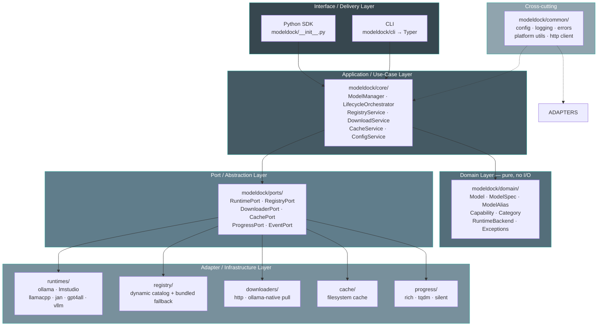

# Design Overview

ModelDock is a **management layer** that sits above local model runtimes. It does not run inference itself; it orchestrates discovery, download, caching, installation verification, and loading through pluggable runtime adapters.

---

## Layered View

Dependencies point inward — Clean Architecture with SOLID principles:

---

## Key Principle

Domain and ports know nothing about Ollama, HTTP, or the filesystem. The application layer depends only on port *interfaces*. Concrete runtimes/downloaders are injected (Dependency Inversion).

This is what makes adding LM Studio, vLLM, etc. a matter of writing one new adapter class — no changes to core logic.

---

## Module Responsibilities

| Module | Responsibility |
|--------|---------------|
| `domain/` | Pure entities (no I/O, no framework). `Model`, `ModelSpec`, `Capability`, `Category`, `ModelRef`, alias rules. |
| `ports/` | `typing.Protocol` interfaces defining what the system needs from the outside world. |
| `core/` | Application services implementing use cases by composing ports. |
| `adapters/runtimes/` | Concrete runtime integrations implementing `RuntimePort`. |
| `adapters/registry/` | Searchable model catalog. Dynamic from ollama.com with bundled fallback. |
| `adapters/downloaders/` | Moves bytes. Ollama native pull or generic HTTP. |
| `adapters/cache/` | Tracks installed/downloaded artifacts. Filesystem manifest + content hashing. |
| `adapters/progress/` | Pluggable progress reporters (rich, tqdm, silent). |
| `cli/` | Thin delivery layer. Translates argv → core service calls. |
| `common/` | Config, logging, platform helpers, shared HTTP client, base errors. |

---

## Design Decisions

| Decision | Rationale | Trade-off |
|:---------|:----------|:----------|
| **Clean Architecture + ports** | Maximum extensibility for 6 future runtimes; testable without Ollama | More files/abstraction upfront; slight "ceremony" for a small v1 |
| **Return runtime-native client** | Stay lightweight; don't reimplement inference | Less uniform cross-runtime inference API (acceptable — management is the product) |
| **Dynamic catalog via HTML scraping** | Always up-to-date with ollama.com; zero manual maintenance | Depends on ollama.com HTML structure; mitigated by 24h cache + bundled fallback |
| **Entry-point plugins** | Third parties extend without forking | Slightly more discovery code; stdlib `importlib.metadata` is cheap |
| **`httpx` over `requests`** | Streaming/resumable downloads, async-ready | Extra dep (small, well-maintained) |
| **Optional runtime SDK extras** | Tiny base install | User may need `pip install modeldock[ollama]` (documented) |

---

## Next Steps

- [Clean Architecture](clean-architecture.md) — dependency rules
- [Runtime Adapters](runtime-adapters.md) — extension points
- [Port Interfaces](ports.md) — the contract
- [Error Handling](errors.md) — typed errors
